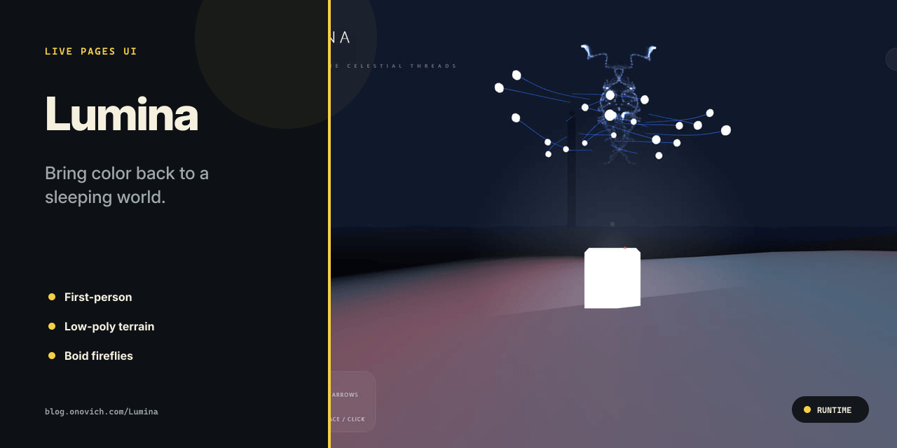

# Lumina

[简体中文](README.zh-CN.md)

Bring color back to a sleeping world.



## What it includes

- First-person.
- Low-poly terrain.
- Boid fireflies.

## Getting started

Install dependencies and start the local version:

```bash
npm install
npm run dev
```

The repository also provides `npm run build`、`npm run test`.

## Repository map

- `src/` — Application and library source.
- `origin/` — Original prototype and design material.
- `.github` — Automation and GitHub Pages workflows.
- `index.html` — Web entry point.
- `package.json` — Package scripts and dependencies.

## Status

The repository contains the implementation and project material described above. No automated tests are currently present; evaluate it by running the project in the target environment.

## License

No open-source license is currently included in this repository.
